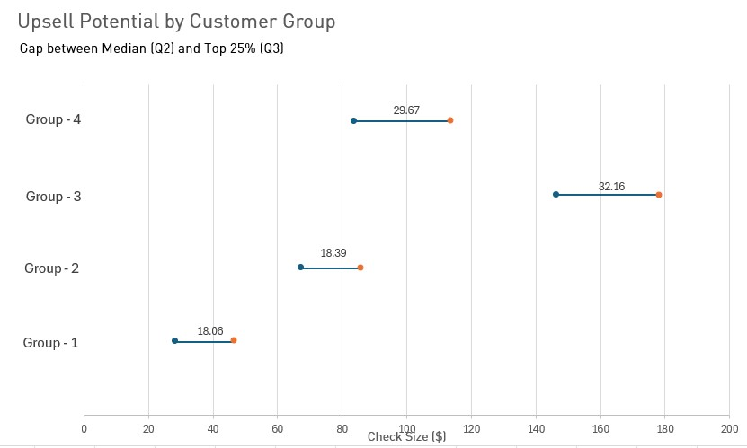

# restaurant-customer-segmentation
GitHub Description : Optimizing restaurant revenue through customer segmentation. Built a custom Python ETL pipeline to parse legacy POS data (PDF to PostgreSQL) and designed an upselling strategy projected to increase seasonal revenue by 6.6%.

Read me : 
#Customer Segmentation: How to leverage upselling in restaurant with Python and SQL

## 📄 [Download Full PDF Case Study](analysis_report.pdf)

## Executive Summary
****The Challenge:** The Goose Pub, a seasonal restaurant, wants to optimize their upselling strategy.

**The Solution:** I built a custom Python ETL pipeline to analyze the transactional data of summer 2025 to build a customer segmentation strategy.

**The Insight:** Identified a **6% revenue growth opportunity** by targeting **41% of the customer** base with specific upselling strategies for appetizers, desserts, and premium beverages.

## Technical Implementation
### 1.Data Engineering (Python ETL)
*Developed a Python ETL pipeline to extract, clean, and structure data from static PDF reports generated by the POS system.
*Validated data integrity against control totals before loading into **PostgreSQL**
**[View ETL Pipeline Documentation](code/)*

###2. The Findings 
**Key Insights:**
Identified that **41% of customers** (generating **44% of total revenue**) are under-monetized. Developing a targeted upsell strategy for these specific groups is projected to drive a **6.6% total revenue increase**.

Generating **12% of total sales** in a concentrated 4-week window, Group 3 acts as a **'hidden gold mine.'** The combination of high upsell potential (spending variance) and a medium appetizer-to-main ratio makes them the primary target for revenue optimization.

*(Fig 1: Dumbbell graph showing upsell potential by customer group)*

##Recommendations
1.Focus on the "Moveable Middle": Redirect sales efforts to **Groups 2 & 3**. Data shows Group 1 has low spending elasticity, while Group 4 is already maximized.

2.Target the Peak Window: Deploy experienced staff to **Group 3** sections specifically during Weeks **ISO 29–33** to capture the season's highest volume period.

3.Operationalize the Data: Use the attached **Rapid Identification Guide** to help servers visually identify segments in real-time and apply the matching upselling protocol.
**[View Rapid Identification Guide](Appendix/)*

---
*View the code in the `/code` folder 
